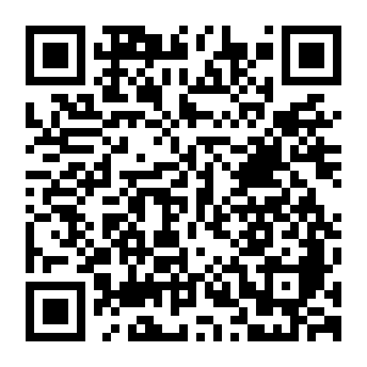

# 🎰 BolãoCalc CAIXA

Calculadora de cotas para bolões da Lotérica CAIXA. Tire foto do comprovante e o app calcula automaticamente quanto cada participante paga.

**▶ Acesse:** https://marcelo888888.github.io/bolaocalc

> Aponte a câmera do celular para o QR code acima para abrir o app.
> Após abrir, configure sua chave Gemini no ⚙️ (veja instruções abaixo).

---

## Como usar

### 1. Primeira vez — configure a chave Gemini

O app usa inteligência artificial (Google Gemini) para ler o comprovante. É gratuito e leva 1 minuto configurar:

1. Acesse [aistudio.google.com/apikey](https://aistudio.google.com/apikey) e faça login com sua conta Google
2. Clique em **"Create API key"** e copie a chave gerada (começa com `AIza...`)
3. No app, toque no ícone ⚙️ (canto superior direito)
4. Cole a chave e salve

A chave fica salva no aparelho — você só precisa configurar uma vez por dispositivo.

---

### 2. Lendo o comprovante

1. Abra o app
2. Toque em **📷 Tirar Foto** (usa a câmera traseira) ou **🖼️ Escolher da Galeria**
   - Se você acessou pelo link do GitHub Pages e o app ainda não confirmou a conexão com o PC (indicador
     **🔗 Abrir local** no canto superior), ao tocar em **Tirar Foto** aparece uma telinha com dois botões:
     **🧮 Só Calc Manual** (calcula aqui mesmo) ou **📡 Transmitir PC** (troca pra versão local e já abre
     a câmera por lá sozinho — não perde a foto nem precisa repetir nada).
3. Aguarde alguns segundos enquanto o Gemini lê o comprovante
4. Confira os dados na tela de detalhes
5. Toque em **📊 Ver Resumo** para ver as cotas

---

### 3. Telas do app

#### Detalhes (linha a linha)
Mostra cada jogo extraído do comprovante com:
- **MOD-CONC** — modalidade e número do concurso (ex: MEGA-2995)
- **Qt** — quantidade de cotas
- **V.Bolão** — valor do bolão
- **V.Tarifa** — tarifa de serviço (em amarelo* se foi estimada pelo app)
- **Cota** — valor por cota = (bolão + tarifa) ÷ cotas

Também exibe o resumo de validação: jogos encontrados, soma total e diferença em relação ao comprovante.

#### Resumo dos Jogos
Duas tabelas:

**Por modalidade** (acima):
| Modalidade | Jogos | Cota (R$) |
|---|---|---|
| MEGA | 4 jogos / 15 cotas | R$ 26,57 |
| QUINA | 2 jogos / 10 cotas | R$ 17,01 |
| LFACIL | 9 jogos / 23 cotas | R$ 10,05 |

**Por valor de cota** (abaixo):
| Cota (R$) | Qt |
|---|---|
| R$ 10,05 | 14 |
| R$ 26,57 | 15 |

---

### 4. Transmitir para o PC

Toque em **📡 Transmitir para o PC** (na tela de Resumo) para enviar os jogos direto pro LCA (aba Scan), sem precisar digitar de novo lá.

A troca pra versão local (quando necessária) já acontece **antes** da foto — ver item 2 acima — então na hora de transmitir normalmente está tudo certo. Esse botão também tem uma rede de segurança: se por acaso você chegar até aqui ainda no GitHub Pages sem a conexão confirmada, tocar nele oferece abrir a versão local — só que, nesse caso específico, os jogos já lidos se perdem e é preciso tirar a foto de novo por lá.

---

## Dicas para melhor resultado

- **Boa iluminação** — evite sombras sobre o comprovante
- **Foto reta** — não inclinada, de cima para baixo
- **Comprovante inteiro** — inclua o cabeçalho e os totais finais
- **Se tiver anotações de caneta** — o Gemini ignora automaticamente, mas quanto menos melhor
- **Foto não funcionou?** — tente mais 2 vezes (o app permite 3 tentativas) ou use **✏️ Digitar Manualmente**

---

## Instalar no celular (PWA)

O app pode ser instalado como aplicativo no celular, sem precisar da loja de apps:

**Android (Chrome):**
1. Abra o app no Chrome
2. Toque no banner "Instalar BolãoCalc" que aparece automaticamente
3. Ou: menu ⋮ → "Adicionar à tela inicial"

**iPhone (Safari):**
1. Abra o app no Safari
2. Toque em compartilhar (□↑) → "Adicionar à Tela de Início"

Após instalado, o app abre em tela cheia e funciona offline (exceto o OCR, que precisa de internet).

---

## Instalar no PC (Chrome)

1. Abra o app no Chrome
2. Clique no ícone de instalar (⊕) na barra de endereço
3. Ou: menu ⋮ → "Instalar BolãoCalc CAIXA"

---

## Problemas comuns

| Problema | Solução |
|---|---|
| "Quota Gemini esgotada" | Gere uma nova chave em [aistudio.google.com/apikey](https://aistudio.google.com/apikey) |
| "Chave inválida ou expirada" | Configure uma nova chave no ⚙️ |
| App mostra versão antiga | F12 → Application → Service Workers → Unregister → Ctrl+Shift+R |
| Tarifa marcada com * amarelo | O app estimou a tarifa por cálculo (vBolão × %TAR) pois o valor no comprovante estava ilegível |
| 0 jogos encontrados | Tire outra foto com mais luz e enquadramento melhor |

---

## Tecnologia

- App 100% no navegador, sem servidor próprio
- OCR por [Google Gemini Vision](https://aistudio.google.com) (modelo `gemini-3.5-flash`)
- PWA com cache offline via Service Worker
- Hospedado no GitHub Pages
